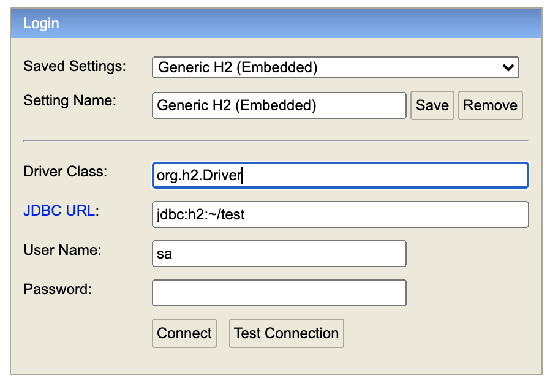

# Getting Started

* To run the application, execute the following in the same package as the jar: `java -jar oddschecker-1.0.0-SNAPSHOT.jar`
* On start up, the database is pre-loaded with 5 `Bet` records (with IDs 1 through 5)
* To view the Swagger documentation, go to: http://localhost:8080/swagger-ui.html#/
* The application uses an in-memory H2 database - to access it (whilst the app is running), go to: http://localhost:8080/h2-console
and include the following connection details:

## Example cURL requests

* Offer odds:
`curl --location --request POST 'http://localhost:8080/odds' \
--header 'Content-Type: application/json' \
--data-raw '	{
	  "betId" : 3,
	  "userId" : "nick",
	  "odds" : "3/2"
	}'`
	
* Get odds:
`curl -X GET --header 'Accept: application/json' 'http://localhost:8080/odds/3'`

## Assumptions
* Users can update odds which they have already submitted
* We don't need to store a history of all odds submitted
* Odds with lower case "sp" are not valid
* When saving odds, all 3 parameters are required (bet id, user id, odds)

## If I had had more time...
* Track down differences between provided Swagger spec and Swagger spec produced from my solution
* Find more elegant way of detecting invalid bet IDs (right now, I am mapping HttpMessageNotReadableExceptions)
